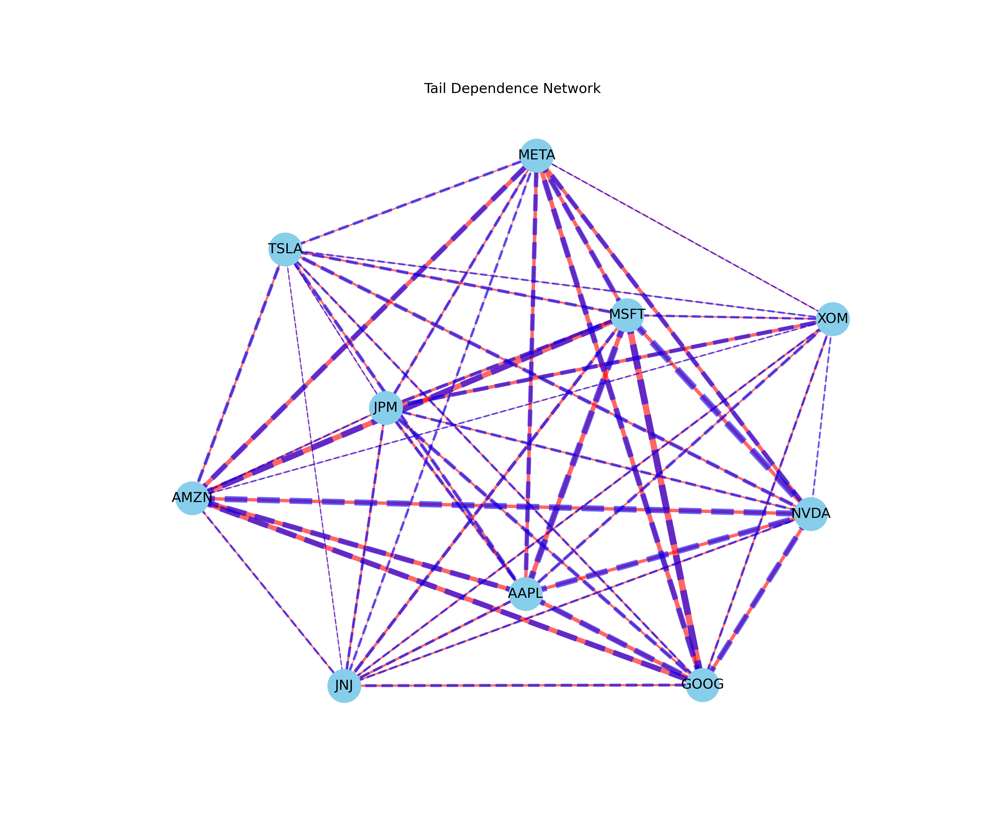

# Advanced Portfolio Optimization System

  
*Visualization of tail risk dependencies between portfolio assets*

## 🔍 Overview
A production-grade portfolio optimization system blending:
- **Classical finance** (Markowitz optimization, EVT risk modeling)
- **Machine learning** (LSTM return forecasting, Random Forest covariance estimation)
- **Risk management** (copula simulations, regime detection)

**Key Features**:
- 3 portfolio strategies: Minimum Variance, Maximum Sharpe, ML-Enhanced
- Dynamic risk-adjusted position sizing
- Interactive Plotly dashboards for real-time monitoring

